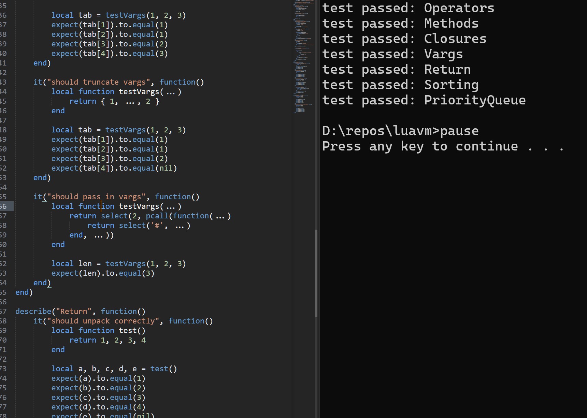

# lua-luau
*<b>A Lua 5.1 runtime made from the ground up in typed Luau</b>* 

## Features
* This project uses the traditional approach of making an AST that gets compiled into custom-made bytecode. All stages were manually written.
* Written with being sandboxed in mind
* Since the runtime is in Luau, make sure that performance critical code remains outside of the main VM

## Planned features
* Reimplementing Luau's syntax and features?
* Optimizing bytecode through inlining, loop unrolling, call alignment, and global access chains to improve interpreter performance

## Goals
* I originally made this to kill time with, but it eventually turned into a really fun deep-dive into my favorite programming language!!

## Pictures

## Contributing
I'm not really looking for contributions for this project, since it's just a fun learning exercise. I just want to show the world this cool project I made. 